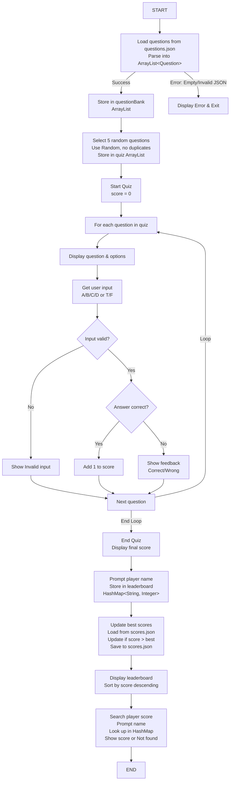

## 📋 **Quiz App – TODO List with Learning Outcomes**

---

### ✅ **TODO 1: Create the `Question` class and model structure**

- **Topics Learned**:
    
    - Classes and Objects
        
    - Encapsulation
        
    - Constructor and toString methods
        

---

### ✅ **TODO 2: Parse questions from a JSON file into an `ArrayList<Question>`**

- **Topics Learned**:
    
    - File I/O
        
    - JSON Parsing (Jackson/Gson)
        
    - Working with `ArrayList`
        

---

### ✅ **TODO 3: Show menu and handle user input to start quiz**

- **Topics Learned**:
    
    - Scanner Input
        
    - Menu-driven CLI
        
    - Loop (`while`, `do-while`) and switch-case control
        

---

### ✅ **TODO 4: Shuffle questions and ask N of them**

- **Topics Learned**:
    
    - `Collections.shuffle()`
        
    - Randomness in logic
        
    - Loop control with condition-based exits
        

---

### ✅ **TODO 5: Take user answer, validate, and provide feedback**

- **Topics Learned**:
    
    - `if-else` condition handling
        
    - Index validation
        
    - Logical branching
        

---

### ✅ **TODO 6: Track score and show result summary**

- **Topics Learned**:
    
    - Variables and arithmetic logic
        
    - Condition-based grading (Excellent, Good, etc.)
        
    - Data summarization
        

---

### ✅ **TODO 7: Create `Player` class and store name + best score**

- **Topics Learned**:
    
    - Object modeling
        
    - Data encapsulation
        
    - Simple file save/load for persistent storage
        

---

### ✅ **TODO 8: Store and retrieve all player scores from JSON file**

- **Topics Learned**:
    
    - `HashMap<String, Player>`
        
    - JSON serialization/deserialization
        
    - File read/write operations
        

---

### ✅ **TODO 9: Show leaderboard (sorted by high score)**

- **Topics Learned**:
    
    - Sorting custom objects with `Comparator`
        
    - Using `ArrayList`, `TreeMap`
        
    - Searching/filtering collections
        

---

### ✅ **TODO 10: Add categories or difficulty levels using `Enum`**

- **Topics Learned**:
    
    - Enums
        
    - Filter logic with `Stream` or iteration
        
    - Enum-switch usage
        

---

### ✅ **TODO 11: Add timer per question (optional)**

- **Topics Learned**:
    
    - Time measurement using `System.currentTimeMillis()`
        
    - Basic performance timing
        
    - Timeout simulation
        

---


---

## 📊 **Table Format – Quiz App TODOs & Topics**

| ✅ TODO # | Task Description                                               | Topics Learned                                                       |
| -------- | -------------------------------------------------------------- | -------------------------------------------------------------------- |
| 1        | Create the `Question` class and model structure                | Classes, Objects, Encapsulation                                      |
| 2        | Parse questions from a JSON file into an `ArrayList<Question>` | File I/O, JSON Parsing, `ArrayList`                                  |
| 3        | Show menu and handle user input to start quiz                  | Scanner Input, CLI Menu, `while`, `switch`                           |
| 4        | Shuffle questions and ask N of them                            | `Collections.shuffle()`, Randomness, Loop control                    |
| 5        | Take user answer, validate, and provide feedback               | Condition Handling, Input Validation, `if-else` logic                |
| 6        | Track score and show result summary                            | Variables, Arithmetic logic, Condition-based grading                 |
| 7        | Create `Player` class and store name + best score              | Class Design, Data Modeling, File-based persistence                  |
| 8        | Store and retrieve all player scores from a JSON file          | `HashMap`, JSON Serialization/Deserialization, File Operations       |
| 9        | Show leaderboard (sorted by high score)                        | Sorting with `Comparator`, `ArrayList`, `TreeMap`, Search and Filter |
| 10       | Add categories or difficulty levels using `Enum`               | Enums, Enum-switch, Filtering with Enum values                       |
| 11       | Add timer per question (optional)                              | Time Measurement (`System.currentTimeMillis()`), Timeout Logic       |

---

## 📋 **Trello-Style Card View**

You can copy-paste this into Trello or any Kanban board app (like Notion or ClickUp) by treating each row as a card.

---

### 📌 TODO 1: Create Question Class

**Description**: Build the basic model for questions with text, options, and correct answer.  
**Skills**: Classes, Objects, Encapsulation

---

### 📌 TODO 2: Parse Questions from JSON

**Description**: Load questions from a JSON file into an `ArrayList`.  
**Skills**: File I/O, JSON Parsing, Collections

---

### 📌 TODO 3: Menu and Input Handling

**Description**: Display a user-friendly CLI menu and capture user choices.  
**Skills**: Scanner, CLI Menu, Loops, switch-case

---

### 📌 TODO 4: Shuffle and Ask Questions

**Description**: Randomly pick N questions and start the quiz.  
**Skills**: Randomness, Looping, Question Flow

---

### 📌 TODO 5: Answer Handling and Feedback

**Description**: Validate answers and show correct/wrong feedback.  
**Skills**: Conditional Logic, Input Validation

---

### 📌 TODO 6: Score Tracking and Summary

**Description**: Keep score, calculate performance, and show summary at the end.  
**Skills**: Arithmetic, Conditions, Output Formatting

---

### 📌 TODO 7: Player Profile with Best Score

**Description**: Store player name and maintain best score.  
**Skills**: Class Design, File Storage, HashMap

---

### 📌 TODO 8: Save/Load Player Data

**Description**: Store all scores in a file and retrieve on app start.  
**Skills**: JSON Serialization, File I/O

---

### 📌 TODO 9: Leaderboard Display

**Description**: Sort and show top players by score.  
**Skills**: Comparator, Sorting, Filtering

---

### 📌 TODO 10: Categories/Difficulty with Enums

**Description**: Let users pick category/difficulty using Enums.  
**Skills**: Enums, Filtering, Logic Separation

---

### 📌 TODO 11: Optional – Add Timer

**Description**: Add a timer per question and track response time.  
**Skills**: Timing with System.currentTimeMillis(), Conditional Timeout Logic

---

If you want this exported as:

- ✅ A **Markdown file**
    
- ✅ A **PDF**
    
- ✅ A **Notion template**
    
- ✅ A **Trello import JSON**
    

```*
START
  |
  v
[Load questions from questions.json] ----------------> (Error: Empty/Invalid JSON)
  | (Parse into ArrayList<Question>)                       |
  | Success                                               v
  v                                                  [Display Error & Exit]
[Store in questionBank (ArrayList)]
  |
  v
[Select 5 random questions]
  | (Use Random, ensure no duplicates)
  | Store in quiz (ArrayList<Question>)
  |
  v
[Start Quiz]
  | Initialize score = 0
  | FOR each question in quiz:
  |   |
  |   v
  | [Display question & options]
  |   |
  |   v
  | [Get user input (A/B/C/D or T/F)]
  |   |
  |   v
  | [Is input valid?] ----> No ----> [Show "Invalid input"]
  |   | Yes                              |
  |   v                                  v
  | [Is answer correct?] ----> Yes ----> [Add 1 to score]
  |   | No                               |
  |   v                                  v
  | [Show feedback (Correct/Wrong)] <----
  |   |
  |   v
  | [Next question]
  |
  v
[End Quiz]
  | Display final score
  |
  v
[Prompt for player name]
  | Store score in leaderboard (HashMap<String, Integer>)
  |
  v
[Update best scores]
  | Load bestScores from scores.json (HashMap)
  | If current score > best score, update bestScores
  | Save bestScores to scores.json
  |
  v
[Display leaderboard]
  | Sort leaderboard by score (descending)
  | Show ranked players
  |
  v
[Search player score]
  | Prompt for player name
  | Look up current/best score in HashMap
  | Display score or "Player not found"
  |
  v
END
```




